# Test VGA ESP32
Test de los modos de vídeo en ESP32 desde el menú utilizando el teclado PS/2 o teclado remoto a través de terminal, como Putty.
 
Seleccione el modo de vídeo con las teclas de flecha arriba y abajo y pulse ENTER para aceptar.
<ul>
 <li>360x200x70hz bitluni</li>
 <li>320x240x60hz bitluni</li>
 <li>320x240x60hz fabgl</li>
 <li>QVGA 320x240x60hz fabgl</li>
 <li>320x200x70hz bitluni</li>
 <li>320x200x70hz fabgl</li>
 <li>360x400x70.4hz bitluni</li>
 <li>400x300x56.2hz bitluni</li>
 <li>320x350x70hz bitluni</li>
 <li>320x400x70hz bitluni</li>
 <li>640x400x70hz bitluni</li>
 <li>TTGOVGA32 PAL CVBS 5V (PAL CVBS GPIO 26)</li>
 <li>TTGOVGA32 PAL CVBS 5V+ (PAL CVBS GPIO 26)</li>
 <li>ESP32 PAL CVBS 3V (PAL CVBS GPIO 26)</li>
 <li>TTGOVGA32 NTSC CVBS 5V (NTSC CVBS GPIO 26)</li>
 <li>TTGOVGA32 NTSC CVBS 5V+ (NTSC CVBS GPIO 26)</li>
 <li>ESP32 NTSC CVBS 3V (NTSC CVBS GPIO 26)</li>
 <li>320x240x60hz bitluni PLL</li>
 <li>320x200x70hz bitluni PLL</li>
 <li>384x264x56.2hz bitluni</li>
 <li>360x240x56.3hz bitluni</li>
 <li>T40x25 320x200x70 bitluni</li>
 <li>T40x30 320x240x60 bitluni</li>
 <li>T50x37 400x300x56.2 bitlun</li>
 <li>T80x50 640x400x70 bitluni</li>
 <li>T80x25 640x400x70 bitluni</li>
 <li>T40x25x3 320x200x70 bitlun</li>
 <li>T40x30x3 320x240x60 bitlun</li>
 <li>T50x37x3 400x300x56.2 bitl</li>
 <li>T80x50x3 640x400x70 bitlun</li>
 <li>T80x60x3 640x480x70 bitlun</li>
 <li>T80x25x3 640x400x70 bitlun</li>
 <li>320x200x1x70Hz bitluni</li>
 <li>320x240x1x60Hz bitluni</li>
 <li>400x300x1x56.2hz bitluni</li>
 <li>640x400x1x70hz bitluni</li>
 <li>800x600x1x54.2hz bitluni</li>
 <li>PIC 250 GTO</li>
 <li>PIC Phantis</li>
 <li>PIC Game Over</li>
 <li>PIC Mandril</li>
</ul>

  
<h1>Versión precompilada</h1>
En la carpeta precompile se encuentra la versión compilada para poder ser grabada con el flash download tool 3.9.2.  
<a href='https://github.com/rpsubc8/ESP32TestVGA/tree/main/ESP32/precompile'>https://github.com/rpsubc8/ESP32TestVGA/tree/main/ESP32/precompile</a>
  
Debemos de elegir el tipo ESP32:

Posteriormente, seleccionaremos los archivos tal y como la captura adjunta, con los mismos valores de offset:

Y le daremos a start. Si todo ha sido correcto, sólo tendremos que reiniciar el ESP32.

  
<h1>Requerimientos</h1>
Se requiere:
 <ul>
  <li>TTGO VGA32 v1.x (1.0, 1.1, 1.2, 1.4)</li>
  <li>Visual Studio 1.66.1 PLATFORMIO 2.5.0 Espressif32 v3.5.0</li>
  <li>Arduino IDE 1.8.11 Espressif System 1.0.6</li>  
  <li>Librería reducida (Ricardo Massaro) Arduino bitluni 0.3.3 (incluida en proyecto)</li>
 </ul>

 
 

  
<h1>ArduinoDroid</h1>
Se debe ejecutar, sólo una vez, el script makeandroid.bat, que nos deja toda la estructura de datos del directorio dataFlash en el directorio raiz, así como reemplazando las archivos principales con llamadas de los .h sin usar el directorio de datos dataFlash. 
Al finalizar, el propio script, termina borrando el directorio dataFlash. 
El script utiliza el fart.exe (find and replace text). 
Una vez, se haya ejecutado con éxito, se puede usar con el ArduinoDroid.

  
<h1>Arduino Web Editor</h1>
Se debe ejecutar, sólo una vez, el script makeandroid.bat. Una vez finalizado, se sube a la nube como un proyecto cualquiera, ya sea comprimido en zip o por archivos.

 
<h1>PlatformIO</h1>
Se debe instalar el PLATFORMIO 2.5.0 desde las extensiones del Visual Studio. Se requiere también Espressif32 v3.5.0. 

Luego se seleccionará el directorio de trabajo <b>ESP32TestVGA</b>.
Debemos modificar el fichero <b>platformio.ini</b> la opción <b>upload_port</b> para seleccionar el puerto COM donde tenemos nuestra placa TTGO VGA32, si por algun motivo no nos lo detecta.

Luego procederemos a compilar y subir a la placa. No se usa particiones, así que debemos subir todo el binario compilado.
Está todo preparado para no tener que instalar las librerias de bitluni ni fabgl.

  
<h1>Arduino IDE</h1>
Todo el proyecto es compatible con la estructura de Arduino 1.8.11.
Tan sólo tenemos que abrir el <b>testvga.ino</b> del directorio <b>testvga</b>.

Debemos instalar las extensiones de spressif en el gestor de urls adicionales de tarjetas <b>https://dl.espressif.com/dl/package_esp32_index.json</b>
 
Ya está preparado el proyecto, de forma que no se necesita ninguna librería de bitluni ni fabgl.
Debemos desactivar la opción de PSRAM, y en caso de superar 1 MB de binario, seleccionar 4 MB de partición a la hora de subir. Aunque el código no use PSRAM, si la opción está activa y nuestro ESP32 no dispone de ella, se generará una excepción y reinicio del mismo en modo bucle.

  
<h1>Test teclado PS/2</h1>
Para testear un teclado PS/2:
<a href='https://github.com/rpsubc8/testkeyboardPS2'>https://github.com/rpsubc8/testkeyboardPS2</a>

  
<h1>Teclado UART</h1>
Se se activa la opción <b>use_lib_keyboard_uart</b>, se permite usar el teclado del PC desde el monitor VStudio o desde el putty (115200 bauds), de manera simple, dado que no es mediante lectura SCANCODE down, up:
<ul>
 <li><b>Tecla TAB o tecla F2:</b> Muestra OSD</li>  
 <li><b>ENTER</b>: Envía ENTER (aceptar)</li>
 <li><b>Arriba:</b> Arriba (incremento 1)</li>
 <li><b>Abajo:</b> Abajo (decremento 1)</li>
 <li><b>Derecha:</b> Derecha (incremento 10)</li>
 <li><b>Izquierda:</b> Izquierda (decremento 10)</li>
</ul>
Desde el Arduino IDE, no se permite dicha funcionalidad, dado que el monitor serie requiere el envio del ENTER por cada acción.

  
<h1>Opciones</h1>
El archivo <b>gbConfig.h</b> se seleccionan las opciones:
<ul> 
 <li><b>use_lib_log_serial:</b> Se envian logs por puerto serie usb</li> 
 <li><b>use_lib_keyboard_poll_milis:</b> Se debe especificar el número de milisegundos de polling para el teclado.</li>
 <li><b>use_lib_fix_double_precision</b> No usa el cálculo de frecuencia de video VGA con el propio ESP32, evitando posibles problemas de precisión con la mantisa. Es útil para ESP32's que calculen mal la frecuencia.</li>
 <li><b>use_lib_debug_i2s</b> Traza con los cálculos del modo de video.</li>
 <li><b>use_lib_vga360x200x70hz_bitluni</b> Modo de video 360x200 con los parámetros de bitluni.</li>
 <li><b>use_lib_vga320x200x70hz_bitluni</b> Modo de video 320x200 con los parámetros de bitluni.</li>
 <li><b>use_lib_vga320x200x70hz_fabgl</b> Modo 320x200 con los parámetros de fabgl.</li>
 <li><b>use_lib_keyboard_uart:</b> Permite usar el teclado del PC desde el PC por terminal monitor VStudio o desde el putty, sin falta de tener teclado. Útil para no tener que usar el teclado físico PS/2 y para desarrollo.</li>
 </ul>

  
<h1>DIY circuito</h1>
Si no queremos usar una placa TTGO VGA32 v1.x, podemos construirla siguiendo el esquema de <b>fabgl</b>:

Para el caso de querer salida de video cvbs, en lugar de VGA, debemos de sacar un cable directo del pin 26 del conector PS/2 del ratón, activando la opción <b>use_lib_cvbs_pal</b>, así como <b>use_lib_cvbs_ttgo_vga32</b> del <b>gbConfig.h</b>. Si no activamos dicha opción, la salida será de más de 1 voltio, teniendo que ser reducida con un reductor de voltaje (potenciómetro).

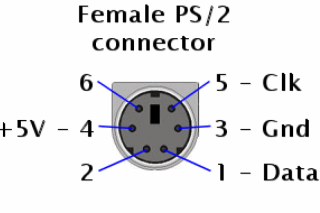

El conector de PS/2 es visto desde el propio jack de la placa, es decir, jack hembra. El pin en PS/2 es el CLK, es decir, el 5.

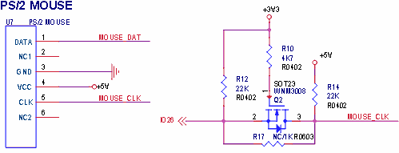

En esta imagen se puede ver el mosfet SOT23 interno de la placa TTGO VGA32, de manera, que la salida en CLK (pin 5) es 5 voltios.

  
<h1>Test DAC cvbs</h1>
Para TTGO VGA32 como la salida es 5v, o hacemos reducción de voltaje o podemos reducir la escala del DAC. En 3.3v de salida, con máximo el valor de 77, ya nos daría 0.99v, que sería 1v. Si tenemos 5v de salida, con 50, ya tenemos 0.97v, que sería 1v. De esta forma, ya no necesitamos resistencias reductoras, es el cable directo. Mientras no nos pasemos de 77 en 3.3v o 50 en 5v, no tendremos problema, sobre todo si sólo necesitamos 2 colores (blanco y negro).
Podemos hacer pruebas con un multímetro, sobre todo en la TTGO VGA32 v1.x:
<pre>
//ESP32 Pin 26
//DAC - Voltaje
//  0 - 0.06
// 38 - 0.52
// 77 - 1
//255 - 3.17

#include <Arduino.h>
#include <driver/dac.h>

const int arrayValue[4]={0,38,77,255};
unsigned char cont=0;

void setup() {
 Serial.begin(115200);
 dac_output_enable(DAC_CHANNEL_2);
}

void loop() {
 dac_output_voltage(DAC_CHANNEL_2, arrayValue[cont]);
 Serial.printf("%d\n",arrayValue[cont]);
 delay(4000);
 cont++;
 cont &= 0x03;
}
</pre>
Los valores máximos al escribir en el buffer de video en una placa ESP32 es de 54, mientras que para TTGO VGA32 v1.x sería de 35.

  
<h1>Monocromo (8 colores)</h1>
En la época clásica se usaban monitores en blanco y negro, de manera que se sacaba más partido frente al color. Aplicando un filtro básico de escala de grises se puede conseguir el mismo efecto, con tan sólo 8 colores y el DAC básico de 3 bits. 
He creado una tool para convertir la paleta de 8 colores en el modo DAC 3 bits (RGB) a un degradado monocromo.
Aquí se puede ver una maqueta de coche del Ferrari 250 GTO con los 8 colores:

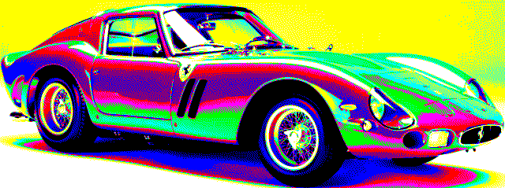

Y aquí activando el filtro de escala de grises con 8 degradados:

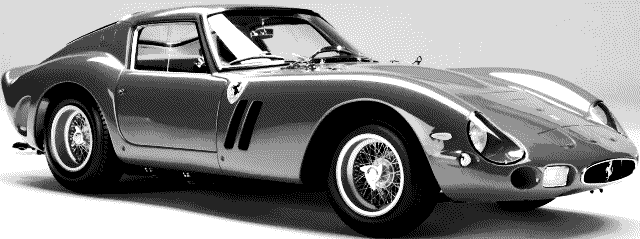

El filtro se puede conseguir fácilmente, con un monitor VGA monocromo. 
En los monitores y TV modernos, si disponen de filtros en el OSD, también es muy sencillo. Si no, se puede variar los valores de cada componente RGB desde el OSD para lograr la saturación. 
Si tenemos una capturadora VGA, podemos aplicar el filtro desde el propio Windows, activando la saturación. 

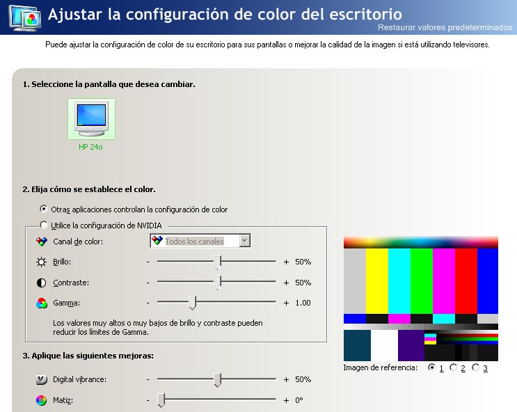

Si ponemos el digital vibrance de 50 a valor 0, nos queda en blanco y negro.

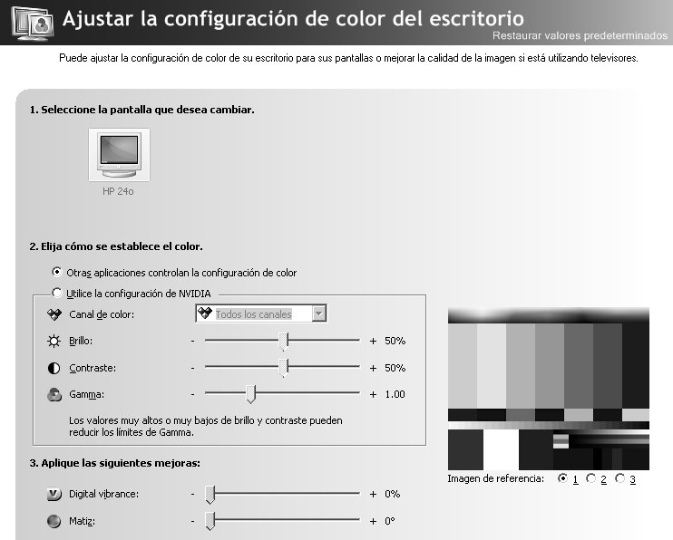

 
Aquí está la paleta del DAC 3 bits de 8 colores con su valor decimal y el binario (RGB):

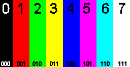

Aquí está, como se vería desde un monitor monocromo:

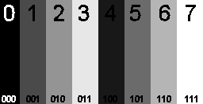

Como se puede ver, el orden lógico no se corresponde con el real de luz. Para eso, si aplicamos un orden por luminancia:

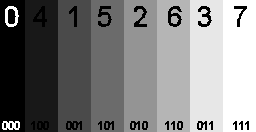

Este orden, es lo que se aplica a la imagen internamente, para que así se puede ver realmente los 8 degradados de gris, de forma que el orden es:
<ul>
 <li>0 - 0</li>
 <li>1 - 4</li>
 <li>2 - 1</li>
 <li>3 - 5</li>
 <li>4 - 2</li>
 <li>5 - 6</li>
 <li>6 - 3</li>
 <li>7 - 7</li>
</ul>
 
Para procesar las imágenes, debemos de convertirlas a escala de gris (256 degradados) desde Gimp o desde Paint Shop Pro, para después aplicar la reducción de 8 colores en degradado de gris:

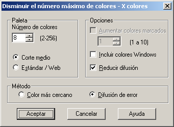

Debemos asegurarnos que nos quedan 8 colores, aunque estemos usando formatos de imágenes con 16.

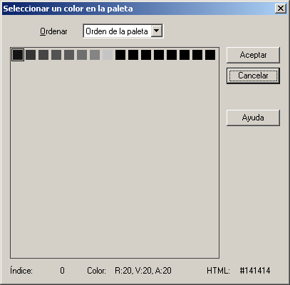

Y por último se aplica una conversión a RAW. 
A la hora de visualizar, se debe aplicar el orden mencionado.  
Aquí tenemos el Phantis con 8 colores:

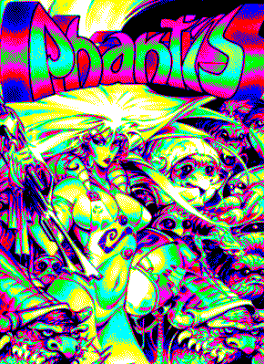

Y aquí en monocromo:

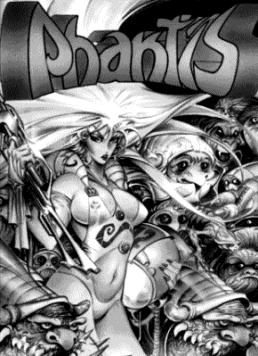

Aquí está el GameOver con 8 colores:

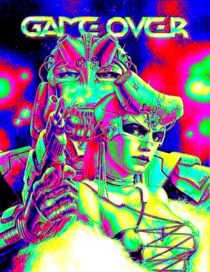

Y aquí en monocromo:

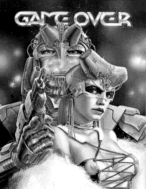

El mandril de test EGA y VGA con 8 colores:

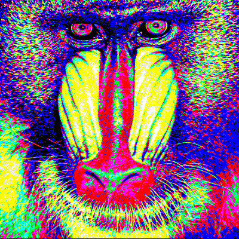

Y aquí en monocromo:

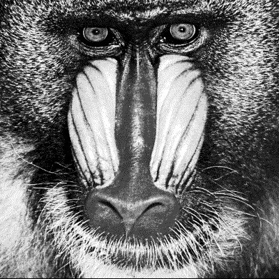

